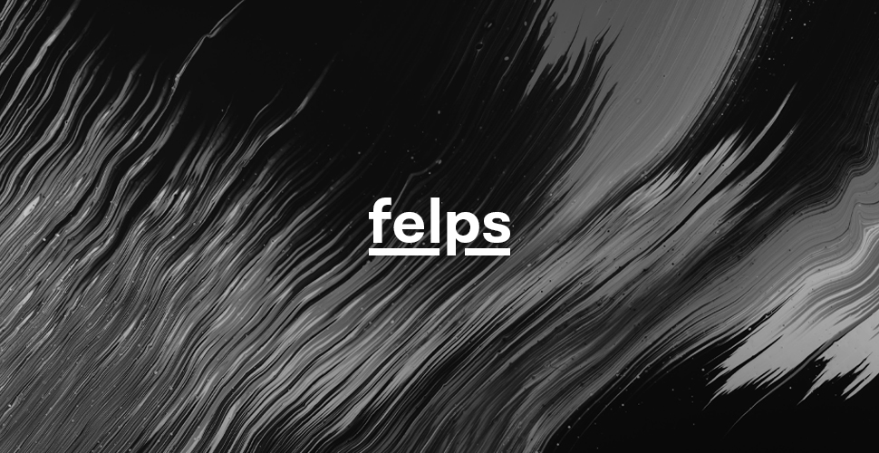

    ⏰  The project is still in an early stage and is bound to have drastic changes.
        Feel free to go through the repo or reach out to know more.

 

 

    Flow-based crawler framework

`npm i felps` / `yarn add felps`

Felps' name comes from the phonetic sound of the name of a well-known international swimmer.

### What is `felps`?
- Soon
### When would `felps` come in handy?
Soon.
